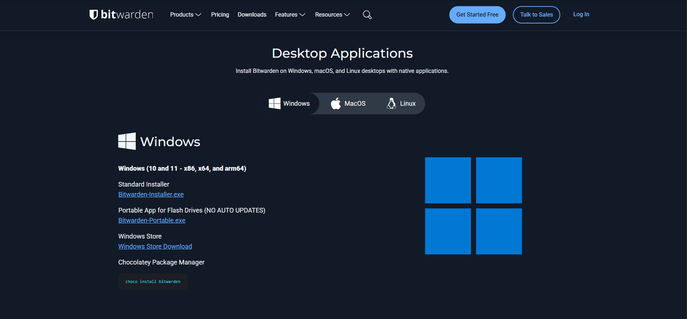
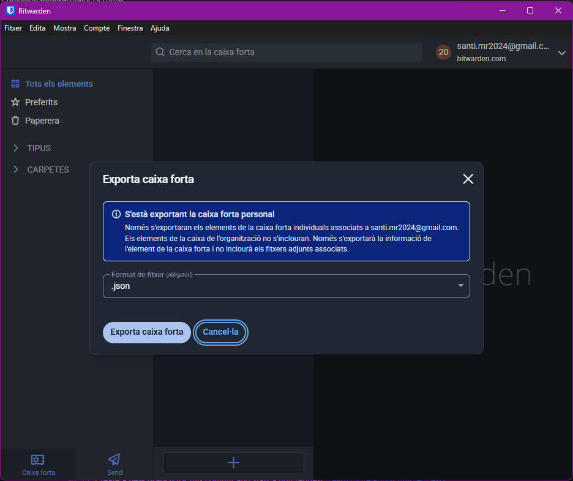

# GUIA
## Instal·lació i Configuració Inicial: 
### Anem a la pagina web i seleccione la pestaña de DOWNLOAD i descarregem bitwarden-installer.exe

### Executem el bitwarden.setup e installem la aplicacio de bitwarden

### Ens sortira una finestra i clicarem a crea un compte

### ficarem el nostre gmail i una contrasenya

### anirem al gmail que em posat i obrirem el gemail que ens and enviat i clicarem en crear una clau mestra

### crearem una contraseña que sera la nostra clau mestra

### I per ultim iniciarem sesio

## Generació de Contrasenyes Segures:
### Clikem en la opcio Mostra --> Gernerador 

### Al entrar podrem generar contrasenyes i seleccionar que vols que s'utilitzi per ferla  

## Exemples d'Ús i Emplenament Automàtic:

## Gestió de Còpies de Seguretat (Backup):
### Cliquem en en fitxer i seleccionem la opcio extreure caixa forta

### seleccionem el tipus de fitxer per descarregar en aquest cas descarregarem en .json
 

