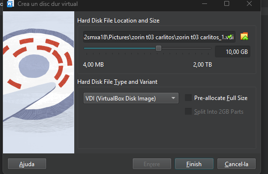

# Guia Completa de LVM amb Discos Virtuals a VirtualBox (Markdown)

Aquesta guia està totalment adaptada al format *Markdown*.

---

## 📌 1. Creació dels Discos Virtuals de 10 GB a VirtualBox

### *1.1. Pantalla inicial d'emmagatzematge*

Aquesta imatge mostra els discs existents assignats al controlador SATA:

(Jo no tinc res a veure amb l'ho de Carlitos)

---

### **1.2. Creació d'un nou disc virtual de 10 GB

Assegura't que la mida és exactament *10 GB*.

---

---

## 📌 2. Procediment Correcte per Crear els 4 Discos de 10 GB

1. Obrir: Configuració → Emmagatzematge.
2. Seleccionar *Controlador SATA*.
3. Clicar: *Afegeix disc dur → Crea*.
4. Configurar:

   * Tipus: VDI
   * Mode: Dynamically allocated
   * Mida: *10 GB*
5. Repetir el procés fins tenir *4 discos de 10 GB*.

---

## 📌 3. Configuració Inicial d'LVM (PV + VG + LV)

### *3.1. Crear particions LVM*
bash
sudo fdisk /dev/sdb
sudo fdisk /dev/sdc
Funció: Obrir l’eina de particionat per crear particions noves.
Acció important: Cal assignar el tipus 8e (Linux LVM).

### *3.2. Crear volums físics (PV)*

bash
sudo pvcreate /dev/sdb1 /dev/sdc1
Funció: Crear Physical Volumes (PV), és a dir, marcar les particions com a compatibles amb LVM.

### *3.3. Crear grup de volums (VG)*
bash
sudo vgcreate vg_dades /dev/sdb1 /dev/sdc1
Funció: Crear un Volume Group (VG), que combina diversos PV en un sol pool d’emmagatzematge.

### *3.4. Crear volum lògic (LV)*

bash
sudo lvcreate -L 5G -n lv_dades vg_dades
Funció: Crear un Logical Volume (LV) dins del VG.
És com crear una “unitat virtual” amb la mida desitjada.

### *3.5. Formatar i muntar*
sudo mkfs.ext4 /dev/vg_dades/lv_dades
Funció: Donar format ext4 al volum lògic.
sudo mkdir /mnt/dades
sudo mount /dev/vg_dades/lv_dades /mnt/dades
Funció: Crear punt de muntatge i muntar el LV al sistema.

---

## 📌 4. Alta Disponibilitat: Mirall LVM

bash
sudo lvconvert --type mirror -m1 vg_dades/lv_dades
Funció: Convertir un LV normal en un LV mirall (redundat).
-m1 = 1 còpia extra (mirall doble).

---

## 📌 5. Instantànies (Snapshots)

### *5.1. Afegir dos discos nous i ampliar el VG*
sudo pvcreate /dev/sdd1 /dev/sde1
Crea PV nous sobre nous discos.
sudo vgextend vg_dades /dev/sdd1 /dev/sde1
Afegeix els PV al VG ja existent.

### *5.2. Crear un LV per dades*
sudo lvcreate -L 8G -n lvm_dades vg_dades
Crea un volum lògic nou de 8 GB.
sudo mkfs.ext4 /dev/vg_dades/lvm_dades
Formata el volum.
sudo mkdir /mnt/lvm_dades
sudo mount /dev/vg_dades/lvm_dades /mnt/lvm_dades
Crea el punt de muntatge i el munta.

### *5.3. Afegir arxius*
wget https://picsum.photos/200/300 -O /mnt/lvm_dades/foto1.jpg
wget https://picsum.photos/400/500 -O /mnt/lvm_dades/foto2.jpg
Descarrega imatges i les desa dins el LV.

### *5.4. Crear snapshot*
bash
sudo lvcreate -L 2G -s -n lv_snapshot /dev/vg_dades/lvm_dades
Funció: Crear un snapshot (còpia temporal) del LV.

### *5.5. Restaurar snapshot*
sudo umount /mnt/lvm_dades
sudo lvconvert --merge /dev/vg_dades/lv_snapshot
Funció: Fusiona el snapshot per tornar l’LV a l’estat anterior.

---

## 📌 6. Escalabilitat: Ampliar LV

### *6.1. Ampliar volum*
sudo lvextend -L +2G /dev/vg_dades/lvm_dades
Funció: Afegir 2 GB extra al volum lògic.

### *6.2. Redimensionar FS*
bash
sudo resize2fs /dev/vg_dades/lvm_dades
Funció: Ampliar el sistema de fitxers perquè ocupi el nou espai del LV.

---
