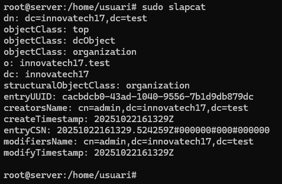
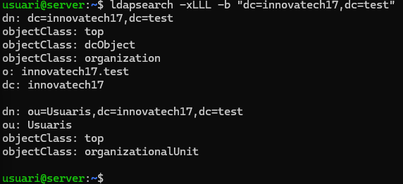
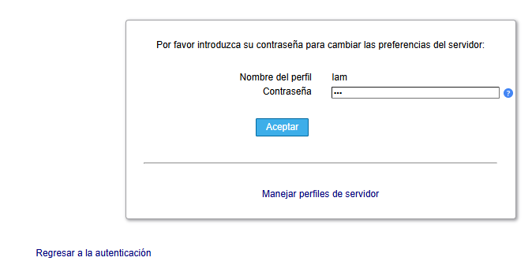
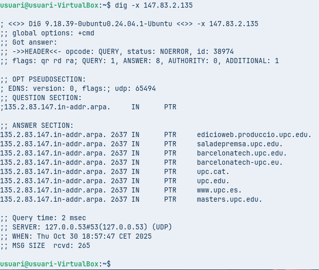
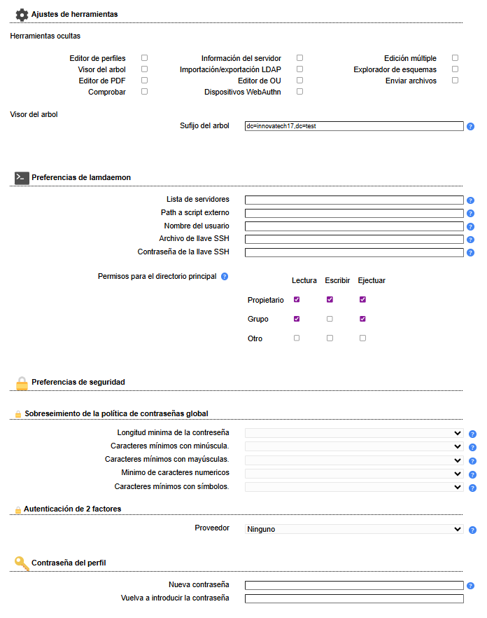
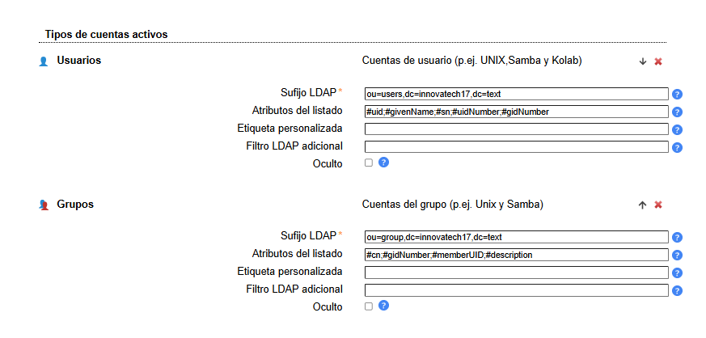
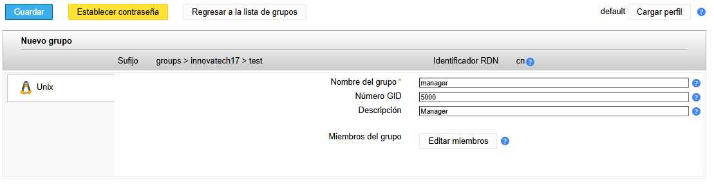
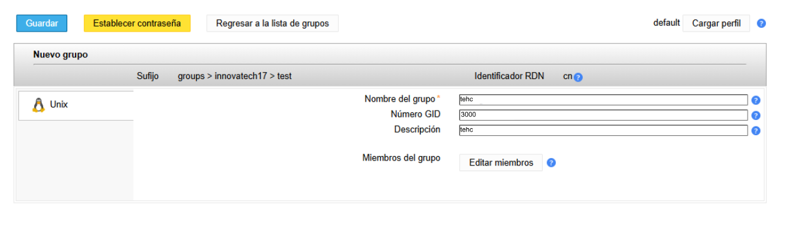
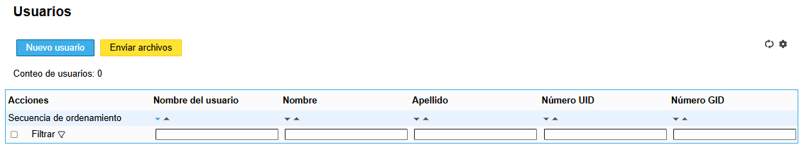

# GUIA LDAP
Instalarem dues maquines virtuals un ubuntus per el servidor i un Zorin per l'usuari, i confugurem els adaptador, el primer ha de estar xarxa nat i el segon en pont i cuan entrem al server configurem el domini per que sigui server.innovatech17.test

## 1. Instalarem LDAP amb la comanda sudo apt install LDAP -y i tendrem que configurem 
### seleccionem que no volem saltar la configuracio 

### posem el domini del nostre server

### fique la una contrasenya en aquest cas posarem p@ssw0rd 

### comprobarem que el servei LDAP funcioni i estigui actiu

### creem les Unitats Organitzatives per els usuaris

### creem les Unitats Organitzatives per els grups

### comproven que estiguin ben creades

### Anyadim un nou usuari com administrador

### Instalarem el LDAP MANAGER

## 2. Configurarem el server usan el LDAP MANAGER desde el buscador del nostre ordinador
### Etrem posant al buscador la ip mes lan i cliquem en configuracio de lam que esta a dalt a la dreta

### Seleccionem de les tres opcions la de Editar perfils del servidor

### Fiquem la contrasenya que es lam

### Configurem tot com esta les imatges

### Anem a la opcio de cuentas que esta adalt a l'esquerra i crearem els grups que seran dos managers i tech

### Ara crearem els usuaris

MANAGER01

TECH01

# 3. cofiguracio del usuari

